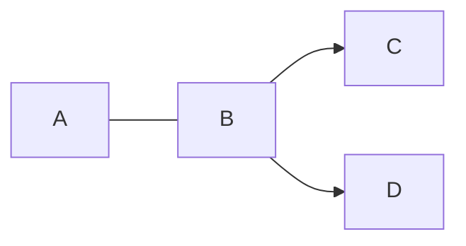

---
head:
  - tag: script
    content: |
      window.op=window.op||function(){var n=[];return new Proxy(function(){arguments.length&&n.push([].slice.call(arguments))},{get:function(t,r){return"q"===r?n:function(){n.push([r].concat([].slice.call(arguments)))}} ,has:function(t,r){return"q"===r}}) }();
      window.op('init', {
        apiUrl: "https://openpanel-api.guarana.studio",
        clientId: 'bd155a5d-9af8-4df0-b6a9-0303523816d2',
        trackScreenViews: true,
        trackOutgoingLinks: true,
        trackAttributes: true,
      });
  - tag: script
    attrs:
      src: https://openpanel.dev/op1.js
      defer: true
      async: true
footer:
  text: Copyright © %YEAR% Docsome
---

# Docsome

> Zero to docs under 15 seconds.

If you are a builder and don't want to spend too much time on documentation maintenance, you are in the right place. All you have to do is create one good [Markdown](https://commonmark.org/help/) file and run Docsome to transform it into attractive documentation.

## Introduction

Docsome is a documentation framework that requires you to maintain only a single Markdown file. Everything else is abstracted and handled by the tooling. While this limits your ability to adjust the setup, there is still configuration that allows you to tweak the documentation.

### Features

#### More abstraction

We abstracted away the whole process of setting up a documentation app and spending hours adjusting it to your liking.

#### Minimal and elegant UI

The appearance of docs and the user interface is tailored to accommodate any branding.

#### Easy to maintain

Got a rough draft of your documentation in a text file? This is a perfect way to start building documentation with Docsome.

#### Fully static

While many other documentation frameworks require you to deploy docs to a server, Docsome produces a truly static page with literally zero routing, so you won't have to deal with rewrites and redirects.

#### AI agent friendly

The documentation site generated for you includes an `/llms.txt` file that helps AI agents find relevant information.

### Getting Started

#### Prerequisites

- [Node.js](https://nodejs.org/)
- Terminal

#### Building

Docsome ships with a CLI (command-line interface) that requires only a single Markdown file to start building your documentation:

##### Using NPM

```sh
npx docsome build DOCS.md
```

##### Using Bun

```sh
bunx docsome build DOCS.md
```

#### Development

For your convenience, the CLI ships with a development server so you don't have to build docs each time you make a change to your Markdown. Run it with:

##### Using NPM

```sh
npx docsome dev DOCS.md
```

##### Using Bun

```sh
bunx docsome dev DOCS.md
```

#### Scripts for JS project

```json
"scripts": {
  "docs:build": "npx docsome build DOCS.md --outDir docs_dist",
  "docs:dev": "npx docsome dev DOCS.md",
}
```

## Writing

### Markdown features

#### Tables

##### Code

```md
| foo | bar |
| --- | --- |
| baz | bim |
```

##### Result

| foo | bar |
| --- | --- |
| baz | bim |

#### Task list items

##### Code

```md
- [x] Fix the kitchen sink
- [ ] Deploy to production
```

##### Result

- [x] Fix the kitchen sink
- [ ] Deploy to production

### Mermaid



### Math

```math
E = mc^2
```

## Configuration

### Reference

#### General settings

```yaml
lang: en # Language of the site, set to <html> tag [default: en]
title: Custom Title # Display name of the tab [default: Docsome]
description: My new site # Meta description of the site
base: /docs/ # Base URL of the site
```

#### Logo

##### Automatic adjustement to color mode

```yaml
logo:
  src: BASE64_OF_SVG_FILE # Base 64 encoded SVG file [default: PHN...mc+]
  invertible: true # If logo colors should invert in the dark mode [default: false]
  alt: My site's logo # Alt text for the logo
```

##### Custom logo for both color modes

```yaml
logo:
  src:
    light: BASE64_OF_SVG_FILE # Base 64 encoded light logo SVG file
    dark: BASE64_OF_SVG_FILE # Base 64 encoded dark logo SVG file
```

#### Head

```yaml
head:
  # Define additional script
  - tag: script
    attrs:
      - defer: true
      - src: https://example.com/script.js
      - data-website-id: 123asd
  # Define additional, external styles
  - tag: link
    attrs:
      - rel: stylesheet
      - href: https://example.com/style.css
  # Define additional, inline script
  - tag: script
    content: |
      window.test('init', {
        clientId: 'YOUR_CLIENT_ID',
      });
```

#### Top Bar

```yaml
topBar:
  links: # Additional links to display in the top bar
    - icon: github # Button's icon [enum: github, twitter, linkedin, facebook, twitch, globe]
      href: https://github.com/guarana-studio
  llms: true # If llms.txt button should be shown in the top bar [default: false]
```

#### Side Bar

```yaml
sideBar:
  linkGroups: # Groups of additional links in the side bar
    - label: Legals
      links: # Additional links
        - href: https://example.com/privacy
          label: Privacy Policy
        - href: https://example.com/terms
          label: Terms of Service
```

#### Footer

```yaml
footer:
  text: Copyright © %YEAR% ACME # Text or HTML to display at the bottom of the page
```

#### Announcement

```yaml
announcement:
  text: Announcement text # Text to display in the announcement
  href: https://example.com # Link to open on announcement click
```

## Recipes

### GitHub Pages deployment

#### Using NPM

```yaml
name: Deploy Docs to GitHub Pages
on:
  push:
    branches: ["main"]
jobs:
  docs:
    name: Publish docs
    runs-on: ubuntu-latest
    needs: build_nightly
    # Grant GITHUB_TOKEN the permissions required to make a Pages deployment
    permissions:
      pages: write
      id-token: write
    # Deploy to the github-pages environment
    environment:
      name: github-pages
      url: ${{ steps.deployment.outputs.page_url }}
    steps:
      - uses: actions/checkout@v4
      - uses: actions/setup-node@v6
        with:
          node-version: 24
      - name: Install dependencies
        run: npm ci
      - name: Build docs
        run: npm run docs:build
      - name: Upload static files as artifact
        uses: actions/upload-pages-artifact@v3
        with:
          path: docs_dist/
      - name: Deploy to GitHub Pages
        uses: actions/deploy-pages@v4
```

#### Using Bun

```yaml
name: Deploy Docs to GitHub Pages
on:
  push:
    branches: ["main"]
jobs:
  docs:
    name: Publish docs
    runs-on: ubuntu-latest
    needs: build_nightly
    # Grant GITHUB_TOKEN the permissions required to make a Pages deployment
    permissions:
      pages: write
      id-token: write
    # Deploy to the github-pages environment
    environment:
      name: github-pages
      url: ${{ steps.deployment.outputs.page_url }}
    steps:
      - uses: actions/checkout@v4
      - uses: oven-sh/setup-bun@v2
      - name: Install dependencies
        run: bun install
      - name: Build docs
        run: bun run docs:build
      - name: Upload static files as artifact
        uses: actions/upload-pages-artifact@v3
        with:
          path: docs_dist/
      - name: Deploy to GitHub Pages
        uses: actions/deploy-pages@v4
```

## Resources

### Roadmap

#### To do

- [ ] AI content search
- [ ] Code highlighting theme settings
- [ ] Toggle for serif font

#### Done

- [x] Code highlighting
- [x] Mermaid integration
- [x] KaTeX integration
- [x] Custom scripts and styles in `<head>`

### Showcase

### Nightly build

There are experimental builds of Docsome availabe.
