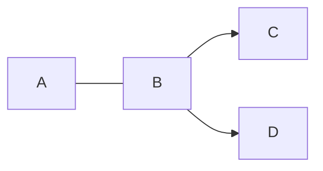

# Docsome

> Zero to docs under 15 seconds.[^*]

[^*]: On a standard machine.

:::alert warning
Docsome is currently in early alpha.
:::

If you ship things fast and want your documentation to keep up, you are in the right place. Write one [Markdown](https://commonmark.org/help/) file, run Docsome, and get a polished documentation site — no boilerplate, no configuration rabbit holes.

## Introduction

Docsome is a documentation framework built around a single constraint: you maintain one Markdown file, and the tooling handles everything else. That means no config files to manage, no build pipeline to wire up, and no time lost on setup. You still get a set of frontmatter options to tailor the site to your project's needs.

### Features

#### No config files

Docsome reads your `.md` file and takes care of Vite, routing, and HTML generation automatically — there is nothing else to set up.

#### Batteries included

Ships with an elegant UI, a light/dark theme, and brand customization support via frontmatter. Looking good out of the box is the default.

#### Easy to maintain

Have a rough draft sitting in a text file? That is already enough to start. Docsome is designed to grow with your documentation, not get in its way.

#### Fully static

Unlike documentation frameworks that require a server to handle routing, Docsome outputs a truly static site with zero client-side routing. No rewrites, no redirects, no infrastructure to babysit.

#### AI agent friendly

Every build automatically generates an `/llms.txt` file, making your documentation easy to discover and consume by AI agents and RAG pipelines.

### Getting Started

#### Prerequisites

- [Node.js](https://nodejs.org/) (v20+)
- Terminal

#### Build your docs

Docsome ships with a CLI that takes a single Markdown file and produces a ready-to-deploy static site:

````tabs

== NPM

```sh
npx docsome build DOCS.md
```

==

== Bun

```sh
bunx docsome build DOCS.md
```

==

````

#### Preview with dev server

The CLI includes a development server that watches your Markdown file and reflects changes instantly — no rebuild needed on every save:

````tabs

== NPM

```sh
npx docsome dev DOCS.md
```

==

== Bun

```sh
bunx docsome dev DOCS.md
```

==

````

#### Scripts for JS project

If your project already has a package.json, add these scripts to run Docsome without typing the full command each time:

```json
"scripts": {
  "docs:build": "npx docsome build DOCS.md --outDir docs_dist",
  "docs:dev": "npx docsome dev DOCS.md",
}
```

## Writing

Docsome is fully compatible with [GitHub Flavored Markdown](https://github.github.com/gfm/), so tables, task lists, and all standard GFM syntax work as expected. On top of that, it ships with first-class support for [Mermaid](https://mermaid.ai/web/) diagrams, KaTeX math, and custom alerts.

### Markdown features

#### Tables

````tabs

== Result

| foo | bar |
| --- | --- |
| baz | bim |

==

== Code

```md
| foo | bar |
| --- | --- |
| baz | bim |
```

==

````

#### Task list items

````tabs

== Result

- [x] Fix the kitchen sink
- [ ] Deploy to production

==

== Code

```md
- [x] Fix the kitchen sink
- [ ] Deploy to production
```

==

````

#### Alerts

Call out important information with styled alert blocks. Four variants are available: info, warning, danger, and success.

````tabs

== Result

:::alert info
This is an additional information.
:::

==

== Code

```md
:::alert info
This is an additional information.
:::
```

==

````

### Mermaid

Render diagrams directly in your Markdown using Mermaid syntax inside a fenced code block:

`````tabs

== Result



==

== Code

````md

````

==

`````

### Math

Render mathematical expressions using KaTeX inside a math fenced code block:

`````tabs

== Result

```math
E = mc^2
```

==

== Code

````md
```math
E = mc^2
```
````

==

`````

### HTML & CSS

Docsome is built with Tailwind and ships with [Basecoat](https://basecoatui.com/), giving you access to a full set of ready-made UI components directly inside your Markdown. Check the full [Basecoat component list](https://basecoatui.com/kitchen-sink/) for all available classes and variants.

````tabs

== Result

<button class="btn-outline" data-tooltip="Tooltip text" data-side="bottom" data-align="center">
  Hover me
</button>

==

== Code

```html
<button class="btn-outline" data-tooltip="Tooltip text" data-side="bottom" data-align="center">
  Hover me
</button>
```

==

````

## Configuration

Docsome intentionally keeps customization focused. Rather than exposing a sprawling config file, all site settings live in the [YAML frontmatter](https://docs.github.com/en/contributing/writing-for-github-docs/using-yaml-frontmatter) block at the top of your Markdown file — the same file you're already editing.

### Reference

#### General settings

```yaml
lang: en # Language of the site, set to <html> tag [default: en]
title: Custom Title # Display name of the tab [default: Docsome]
description: My new site # Meta description of the site
base: /docs/ # Base URL of the site
```

#### Logo

````tabs

== Automatic inversion

```yaml
logo:
  src: BASE64_OF_SVG_FILE # Base 64 encoded SVG file [default: PHN...mc+]
  invertible: true # If logo colors should invert in the dark mode [default: false]
  alt: My site's logo # Alt text for the logo
```

==

== Separate mode logo

```yaml
logo:
  src:
    light: BASE64_OF_SVG_FILE # Base 64 encoded light logo SVG file
    dark: BASE64_OF_SVG_FILE # Base 64 encoded dark logo SVG file
```

==

````

#### Head

```yaml
head:
  # Define additional script
  - tag: script
    attrs:
      defer: true
      src: https://example.com/script.js
      data-website-id: 123asd
  # Define additional, external styles
  - tag: link
    attrs:
      rel: stylesheet
      href: https://example.com/style.css
  # Define additional, inline script
  - tag: script
    content: |
      window.test('init', {
        clientId: 'YOUR_CLIENT_ID',
      });
```

#### Top Bar

```yaml
topBar:
  links: # Additional links to display in the top bar
    - icon: github # Button's icon [enum: github, twitter, linkedin, facebook, twitch, globe]
      href: https://github.com/guarana-studio
  llms: true # If llms.txt button should be shown in the top bar [default: false]
```

#### Side Bar

```yaml
sideBar:
  linkGroups: # Groups of additional links in the side bar
    - label: Legals
      links: # Additional links
        - href: https://example.com/privacy
          label: Privacy Policy
        - href: https://example.com/terms
          label: Terms of Service
```

#### Footer

:::alert info
`%YEAR%` will be replaced with the current year at build time.
:::

```yaml
footer:
  text: Copyright © %YEAR% ACME # Text or HTML to display at the bottom of the page
```

#### Announcement

```yaml
announcement:
  text: Announcement text # Text to display in the announcement
  href: https://example.com # Link to open on announcement click
```

## Recipes

### GitHub Pages deployment

The workflow below builds your docs and deploys them to GitHub Pages on every push to main. It assumes you have added the docs:build script to your `package.json` as shown in [Getting Started](/#getting-started).

````tabs

== NPM

```yaml
name: Deploy Docs to GitHub Pages
on:
  push:
    branches: ["main"]
concurrency:
  group: pages
  cancel-in-progress: true
jobs:
  docs:
    name: Publish docs
    runs-on: ubuntu-latest
    # Grant GITHUB_TOKEN the permissions required to make a Pages deployment
    permissions:
      pages: write
      id-token: write
    # Deploy to the github-pages environment
    environment:
      name: github-pages
      url: ${{ steps.deployment.outputs.page_url }}
    steps:
      - uses: actions/checkout@v4
      - uses: actions/setup-node@v6
        with:
          node-version: 24
      - name: Install dependencies
        run: npm ci
      - name: Build docs
        run: npm run docs:build
      - name: Upload static files as artifact
        uses: actions/upload-pages-artifact@v3
        with:
          path: docs_dist/
      - name: Deploy to GitHub Pages
        uses: actions/deploy-pages@v4
```

==

== Bun

```yaml
name: Deploy Docs to GitHub Pages
on:
  push:
    branches: ["main"]
concurrency:
  group: pages
  cancel-in-progress: true
jobs:
  docs:
    name: Publish docs
    runs-on: ubuntu-latest
    # Grant GITHUB_TOKEN the permissions required to make a Pages deployment
    permissions:
      pages: write
      id-token: write
    # Deploy to the github-pages environment
    environment:
      name: github-pages
      url: ${{ steps.deployment.outputs.page_url }}
    steps:
      - uses: actions/checkout@v4
      - uses: oven-sh/setup-bun@v2
      - name: Install dependencies
        run: bun install
      - name: Build docs
        run: bun run docs:build
      - name: Upload static files as artifact
        uses: actions/upload-pages-artifact@v3
        with:
          path: docs_dist/
      - name: Deploy to GitHub Pages
        uses: actions/deploy-pages@v4
```

==

````

## Resources

### Nightly build

[Nightly builds](https://pkg.pr.new/~/guarana-studio/docsome) track the latest commits on main and are published automatically via pkg.pr.new. Use them to try out unreleased features or test a fix before it lands in a stable release:

```sh
npx https://pkg.pr.new/guarana-studio/docsome@main build DOCS.md
npx https://pkg.pr.new/guarana-studio/docsome@main dev DOCS.md
```
